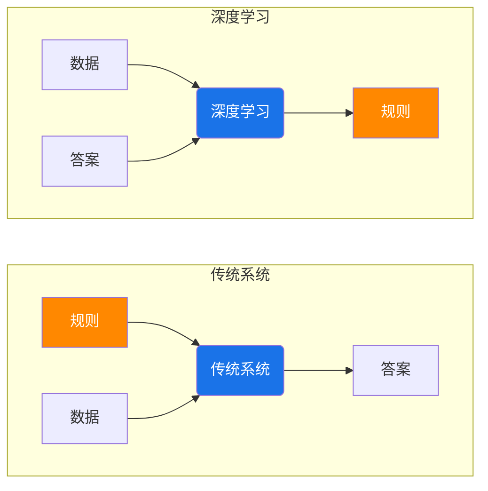

# 深度学习简介与环境

## 0. 与传统方法对比



## 1. 所需编程环境和工具

```powershell
Python==3.8
TensorFlow==2.4.0
Keras==2.4.3
numpy==1.19.5
pandas==1.3.5
matplotlib==3.4.2
sklearn==0.0
```

>Anaconda蛮大的，≈ 65 GB

```powershell
conda create -n keras python==3.8
# 确认environment location后再安装
conda env list
conda activate keras
conda list
pip install tensorflow==2.4.0
pip install keras==2.4.3
pip install numpy==1.19.5
pip install pandas==1.3.5
pip install matplotlib==3.4.2
pip install sklearn==0.0
```


## 2. 线性回归算法

1. **线性回归：**数据集 `D(x[1-m],y[1-m])` , x称为特征，y称为标签，找f(x)构建线性关系，使得

$$
f(x) = w^T x +b
$$

2. **误差函数：**均方误差函数
   $$
   J(x) = \frac{1}{2m}\sum_{i=1}^{m} (f(x_i)-y_i)^2
   $$
   这个过程就是*寻找一组参数，使得误差函数最小*

3. **参数求解：**

   - 穷举法：一个个试，找 w_i, b

   - 最小二乘法：*二次函数算极值*
     $$
     f(x) = w^T x +b
     \\把\ b写入矩阵中
     \\X=\begin{pmatrix}
     x_{11} & x_{12}& \dots & x_{1m} & 1\\
     x_{21} & x_{22}& \dots & x_{2m} & 1\\
       \vdots&\vdots& \ddots & \vdots&\vdots\\
     x_{m1} & x_{m2}& \dots & x_{mm} & 1\\
     \end{pmatrix}
     \\
     w=\begin{pmatrix}
     w_1\\
     w_2\\
     \vdots
     \\w_m\\
     b
     \end{pmatrix}
     \\f(x)=Xw
     $$
     对矩阵求导（过程省略），得,
     $$
     \frac{\partial J(w)}{\partial w}=0 \ => 
     \\w=(X^TX)^{-1}X^TY\\
     (当X^TX可逆时才有解)
     $$
     
   - 梯度下降法：*求梯度，给步伐*
     $$
     w1=w_0 + (-\alpha·\frac{\partial J(w_0)}{\partial w_0})\\
     w2=w_1 + (-\alpha·\frac{\partial J(w_1)}{\partial w_1})\\
     \vdots
     $$
     步伐太大容易多迈步子，步伐太小时间长

4. **实战代码：**

   ```python
   # linear-regression.py
   # 定义数据集
   
   # 定义数据特征
   x_data = [1, 2, 3]
   # 定义数据标签
   y_data = [2, 4, 6]
   
   # 初始化参数槽，可定制
   w = 4
   
   # 定义线性回归模型
   def forward(x):
       return w * x
   
   # 定义损失函数
   def cost(xs, ys):
       cost_value = 0
       # zip(xs, ys) 的作用是将两个列表中的对应元素打包成元组
       for x, y in zip(xs, ys):
           f_x = forward(x)    # 预测f(x)
           cost_value += (f_x - y) ** 2
           return cost_value / len(xs) # 求平均
   
   # 定义梯度函数
   def gradient(xs, ys):
       grad = 0
       for x, y in zip(xs, ys):
           # partial J(w)/ partial w = 2x(wx-y)
           grad += 2 * x * (x * w - y)
           return grad / len(xs)
   
   #模型训练，epoch（周期/代次）是指在训练神经网络时，整个训练数据集被完整地向前传播和反向传播一次。
   for epoch in range(100):
       cost_val = cost(x_data, y_data)
       grad_val = gradient(x_data, y_data)
       alpha = 0.01    # 步伐
       w = w - alpha * grad_val    # 梯度下降
       # print('训练轮次：',epoch+1, 'w(权重值)：',w,'损失函数：',cost_val)
   
   print('100轮训练后的w: ',w,'预测下一个特征（4）的标签值（8）：',forward(4))
   ```

## 3. 逻辑回归算法（用回归解决二分类问题）

0. **机器学习分类**

   - 监督学习
     - 回归
     - 分类
   - 无监督学习

1. **sigmoid 函数**
   $$
   g(z)=\frac{1}{1+e^{-z}}
   $$
   将任意实数映射到 (0,1)，变成概率

   将 z 替换为 f(x)，得到逻辑回归模型
   $$
   g(X)=\frac{1}{1+e^{-w^TX+b}}
   $$

2. **二分类问题**

   
