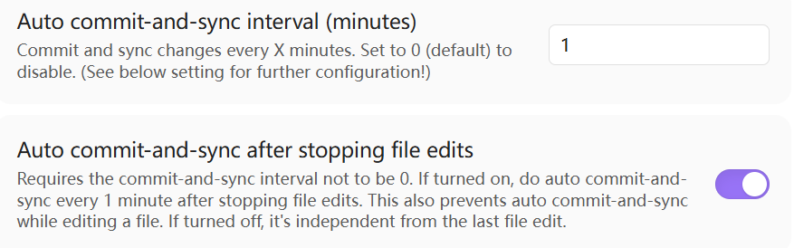
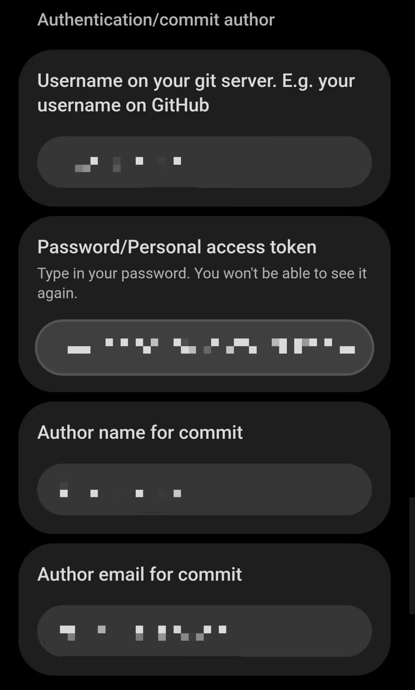
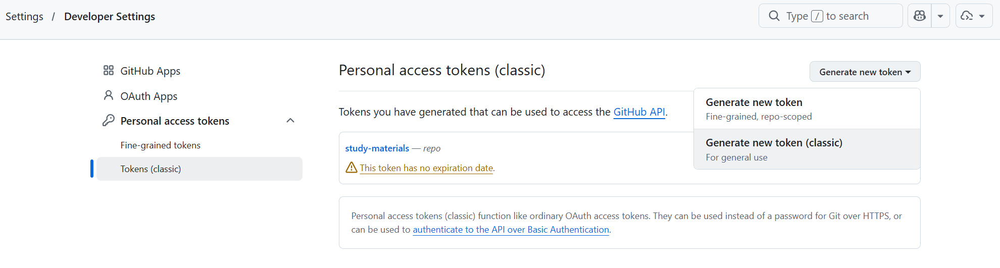
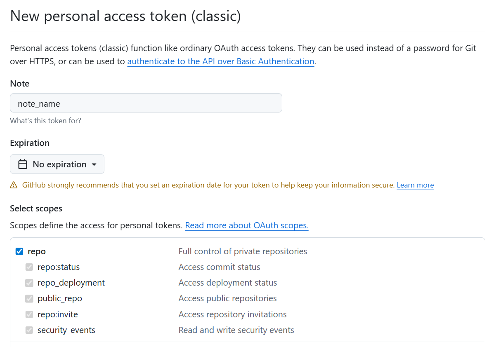

# 从零开始搭建

## 下载obsidian

[Obsidian - Sharpen your thinking](https://obsidian.md/)官网下载，开梯子下的更快

## 云同步

1. 网站登录`github`，新建`repository`，（*git push*相关的目录）

   > `git bash` 梯子用不了就用 `github desktop` 手动上传

2. 用 `obsidian` 打开目标文件夹，首页创建 `.gitignore`，写上

   ```cmd
   .obsidian/workspace.json
   .obsidian/workspace-mobile.json
   ```
3. 安装 `Git` 插件，设置

## AI

通过 `Claude code` 处理，详细见

## 图像处理

1. 安装 `Custom Attach Location` 插件
2. 修改 :
   - `Markdown URL 格式` 为 `assets/${noteFileName}/${generatedAttachmentFileName}` 
   - `附件重命名模式` 选择全部
   - `是否重命名附件文件`勾选

## 手机同步

1. 把电脑上的整个仓库文件夹复制到手机 `Document` 目录下（路径通常是 `内部存储/Documents/你的仓库名`）。

2. 手机安装 `Obsidian`，选择“打开文件夹作为仓库”，指向刚才粘贴的目录。

3. 安装 ` Git` 插件，进入设置：

   仅需设置以下内容
   
   其中，
   - 第1,3,4项，填写个人github账号
   - 第2项，需打开
   设置

4. 尽量手机电脑同时编辑一个文件

## 导出

1. 安装 `Enhancing Export` 插件
2. 添加 `Pandoc` 路径
3. 选择 Markdown 笔记，右键即可导出
## 引用笔记与知识图谱

1. 输入两对中括号即可引用笔记
2. ^（Ctrl）点击即可跳转
3. 可查看知识图谱