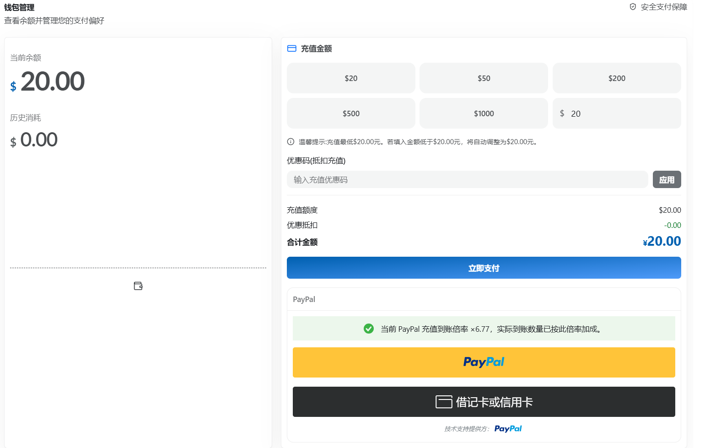
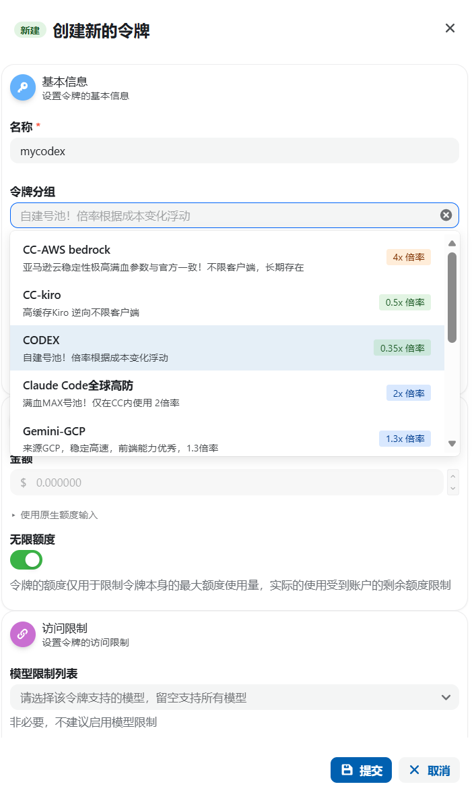
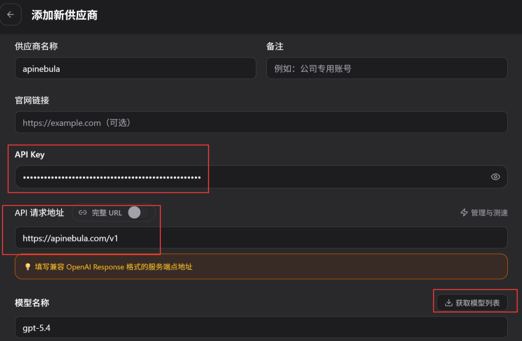
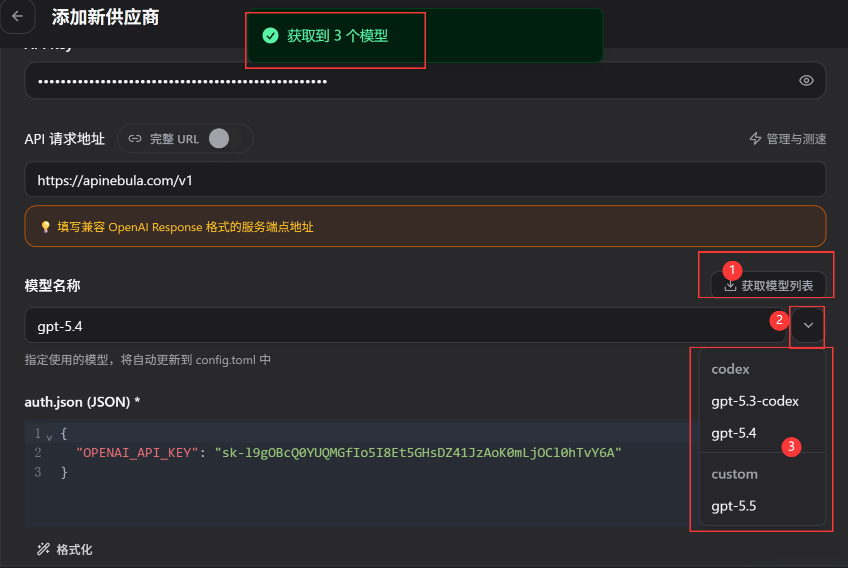

# 安装

## 桌面版

微软商店下载 [Codex]([https://apps.microsoft.com/detail/9plm9xgg6vks?hl=zh-cn&gl=GF](https://apps.microsoft.com/detail/9plm9xgg6vks?hl=zh-cn&gl=GF))

下载完之后，并不能直接用，需要登录gpt账号或者使用apikey的方式

## CLI

**需要安装node.js环境**

npm命令
```PowerShell
npm i -g @openai/codex
```

## CC Switch下载

参考 [CC Switch](Claude-Code配置.md#3.%20配置大模型)

# 中转站接入

由于用OpenAI账号进入Codex需要海外手机号、海外信用卡等操作，故我这里通过中转站进行。

[Apinebula]([https://apinebula.com/](https://apinebula.com/1bwHRe))

## 注册进入，充20块钱



## 新建令牌，选择CODEX（便宜），其余不变


## CC Switch配置

### 选择Codex


### 新建供应商

供应商名称随便写

apikey复制令牌

api请求地址固定写 `https://apinebula.com/v1`



### 获取模型列表



点击启用，测试模型

重启Codex，并选择**API登录**，填写令牌密钥即可

---

# 个人账号登入（需苹果移动版）

注册外区（日区）apple id

电脑下载iTunes，通过AI填写地址信息

手机 apple store 登录

下载 OpenVXS 并登录ikuuu（fq）

咸鱼购买礼品卡

apple store 兑换

下载并使用apple登录chatgpt

购买Plus，提前买好3000日元直接支付

全程无需使用外卡和apple pay

官网下载codex可以直接登录（CC-Switch 配置codex为official）