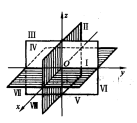
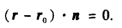
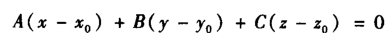
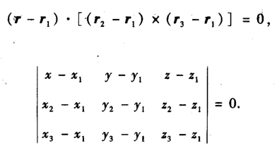
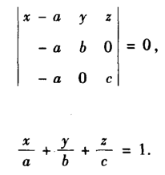
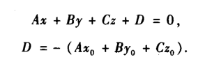
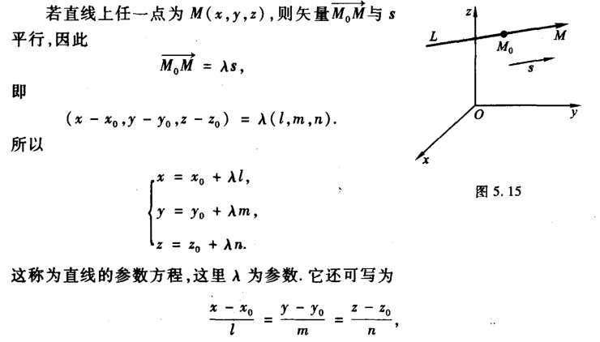
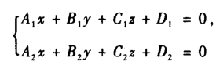
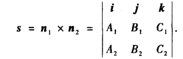

> 之前研究二维平面下的函数，升维前需要先看看空间几何是怎么一回事，怎么描述和计算，便于对抽象关系的直观理解

# 三维直角坐标系与向量

作为**数学语言**描述空间的点，然后点动成线、线动成面

三维直角坐标系可以分为8个卦限
从xyz正逆时针绕下来

向量看 [[向量空间]] 的内容

# 平面

平面方程就是怎么描述一个平面的问题

1. 给了 一个点，一个法向量（点法式）

2. 给了 三个不共线的点（三点式）

展开方法在 [[行列式]]

3. 给的这三个点恰好在三个坐标轴上（截距式）

4. 以上三张情况合并起来的一般方程（一般式）

只要ABC不全为0，就是一个平面

# 直线

1. 给了 直线上一个点和直线矢量（点向式）

本质是一个参数方程

>求交点时用参数方程的形式求 t 

2. 给了 两个点：直接变成情况 1

3. 给了两个平面，相交得到的直线（一般式）

这个直线向量垂直于两个面的法向量：

